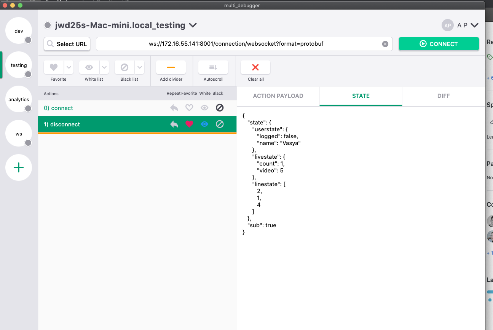

# multi_debugger

многофункциональная программа для отладки, просмотра логов и других функций

## About

В основе программы лежит кроссплатформенный движок Flutter и [Hover](https://github.com/go-flutter-desktop/hover) в качестве компилятора под десктоп.
Для коммуникации с сервером используется real-time сервер доставки сообщений [centrifugo](https://github.com/centrifugal/centrifugo)
Сервер имеет реализации клиента под различные языки, в т.ч. Dart
Для запуска сервера используется Docker контейнер, который можно запустить из папки: scripts/app.sh up
multi_debugger позволяет просматривать логи, отладку приложения, time-travel(ToDo) в вашем Redux-приложении. Так же можно
просматривать состояния из различных источников, по разным URL. Для этого используется настройка каналов

Для фильтрации контента используются различные фильтры,такие как белый/черный список, избранные

## Getting Started

Для запуска вам понадобится Hover. Под мобильные девайсы не тестировалось, потому что программа имеет свои минимально допустимые размеры
Если вы используете VSCode, выберите таргет Debug Hover и просто запустите, Hover сам скачает нужные зависимости и запустит приложение
В других IDE вам нужно вручную запустить скрипт из корня приложения: bash scripts/app_hover.sh

# Working

example:

# Process

Platform | Hover | Web | Linux/MacOs/Windows
:------------ | :-------------| :-------------| :-------------
support | :heavy_check_mark: |  :heavy_check_mark: | :x:
